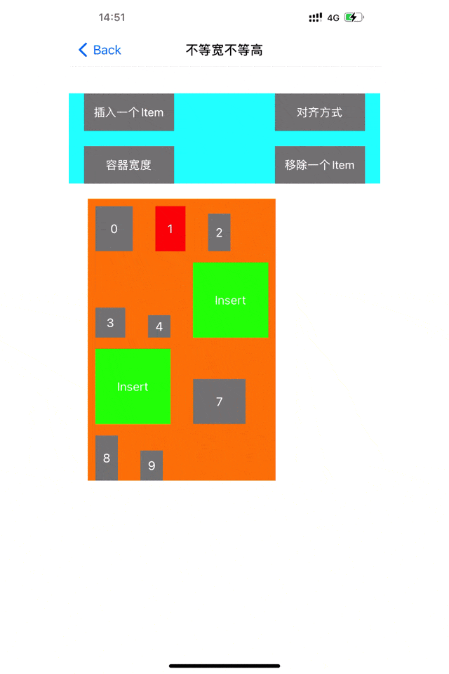

# TagView
轻量级标签选择控件，采用Swift编写

# 该库即将停止维护，将使用UICollectionView实现标签列表，详见[SwiftyCollectionViewFlowLayout]()

# 为什么写这个库?
&emsp;&emsp;标签选择功能相信大家在项目中是经常会碰到的，那么大家是怎么解决的呢？是每次都自己写一个还是去找别人写好的呢？如果自己写的话，封装性和扩展性是否很好呢？<br/>
&emsp;&emsp;本人由于多次使用到标签选择功能，又想着这种自定义`View`不是很复杂，因此每次都是重新自己写一个自定义`View`，没有考虑过是否方便移植到其他项目模块，久而久之，会发现，做了很多重复的事，浪费了很多不必要的时间。<br/>
&emsp;&emsp;鉴于此，就写了这个开源库，由于是UI的封装，因此在这个库里，把item的很多定义都交给开发者自己来完成。尽量做到侵入性低，扩展性强。<br/>

## 效果预览


## 安装
#### 手动
推荐使用`CocoaPods`

#### CocoaPods

```
pod 'TagView-Swift'
```
如果提示未找到，先执行`pod repo update`，再执行`pod install`。理论上支持`iOS 9.0`以上系统

## 使用(具体用法请查看Demo，使用方法非常简单)
1、初始化`TagView`
```
let tagView = TagView()
tagView.backgroundColor = .orange
tagView.lineSpacing = 15.0
tagView.interitemSpacing = 30.0
tagView.inset = UIEdgeInsets(top: 10, left: 10, bottom: 10, right: 10)
tagView.verticalAlignment = .top
self.view.addSubview(tagView)

tagView.snp.makeConstraints { (make) in
    make.left.equalToSuperview().offset(10)
    make.top.equalToSuperview().offset(100)
    make.right.equalToSuperview().offset(-10)
    // 不需要设置高度
}
```
2、设置`items`
```
var items: [TagItem] = []
for i in 0..<20 {
    let label = UILabel()
    label.textAlignment = .center
    label.font = UIFont.systemFont(ofSize: 16)
    label.textColor = .white
    label.backgroundColor = .red
    label.text = "\(i)"
    
    let item = TagItem(customView: label, width: .auto, height: .auto)
    items.append(item)
}
self.tagView.add(items: items)

```
## 使用过程中的注意事项
- 该框架内部做了屏幕旋转的适配，因此不比担心屏幕旋转时，内部元素的排列。
- 该开源库适合`item`数量不是很多的情况下使用，如果数据很多，请考虑使用`UICollectionView`。当然，非要使用`TagView`也不是不可以，只是要考虑好内存使用的情况。
- 该库没有做滚动兼容，如果`item`排版超出屏幕了，可以用`UIScrollView`来包裹`TagView`来达到滚动效果
- 如果`item`的高和宽要根据自身内容做自适应，请把`TagItem`的`width`和`height`属性设置为`auto`，然后自定义`view`，最后在自定义`view`里面重写`intrinsicContentSize`方法。
- `TagView`支持`AutoLayout`和`Frame`布局。

## 更新记录(倒叙)
### 4、2.0.0（2021.05.29）
- 移除`OC`支持，之后只支持`Swift`
- 模块重新命名
- 代码优化

### 3、1.0.2（2020.12.03）
- 修改Bug

### 2、1.0.1（2020.12.01）
- 优化

### 1、1.0.0（2020.10.24）
- 发布首个版本

## 补充
该仓库会不断进行优化，在使用过程中，有任何建议或问题，欢迎提issue，或者通过邮箱1035841713@qq.com联系我<br>
喜欢就star❤️一下吧
